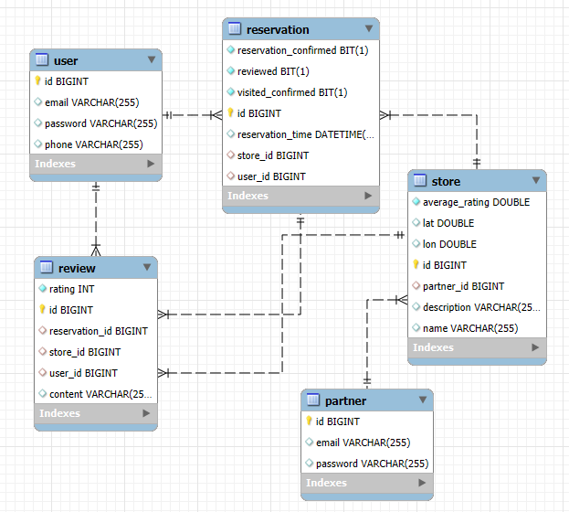

# ✨ Catch Table

## **프로젝트 소개**
매장 점장이 예약 서비스를 효율적으로 관리하고, 이용자가 간편하게 예약할 수 있도록 설계된 백엔드 API입니다.

- **매장 등록**: 점장은 파트너 회원가입 후 즉시 상점 정보(매장 명, 위치, 설명)를 등록할 수 있으며, 별도의 승인 절차 없이 바로 이용 가능합니다.
- **예약 및 정보 확인**: 이용자는 앱을 통해 매장을 검색하고 상세 정보를 확인한 후, 회원 가입 후 예약을 진행할 수 있습니다.
- **방문 확인**: 예약 후 매장을 방문 시, 도착 10분 전에 키오스크를 통해 방문 확인을 진행합니다.
- **리뷰 작성**: 예약 후 리뷰를 작성할 수 있으며, 수정은 작성자만 가능하고 삭제는 작성자 및 매장 관리자만 가능합니다.
- **예약 관리**: 점장은 들어온 예약 요청을 승인 또는 거절할 수 있습니다.

## **🔧 주요 기능**
- **🔐 JWT 인증**: 안전한 로그인 및 인증을 위한 토큰 기반 시스템.
- **👤 사용자 관리**: 사용자 CRUD 기능 및 역할 기반 접근 제어.
- **🤝 파트너 관리**: 파트너 회원 CRUD 기능 제공.
- **📄 Swagger 통합**: API 문서화를 통한 테스트 및 활용 지원.
- **🛡️ 보안 설정**: Spring Security 기반의 맞춤형 보안 설정.

## **💻 사용 기술**
- **백엔드**: Spring Boot
- **보안**: Spring Security, JWT
- **API 문서화**: Swagger
- **빌드 도구**: Gradle
- **데이터베이스**: MySQL
- **기타**: Lombok 등

## **📃 ERD**


## **📌 API**

### - 인증 관련 API - ###
1. 회원가입 (파트너/유저)
2. 로그인 (파트너/유저)
3. 정보 수정 (파트너/유저)
4. 계정 삭제 (파트너/유저)

### - 파트너 API - ###
* 모든 요청은 Bearer Authentication 필요
1. 상점 추가
2. 상점 조회
3. 상점 수정
4. 상점 삭제
5. 리뷰 조회/삭제
6. 예약 정보 조회/승인/취소

### - 유저 API - ###
* 모든 요청은 Bearer Authentication 필요
1. 상점 목록 조회
2. 상점 상세 정보 조회
3. 키워드로 상점 조회
4. 예약하기/방문 확정
5. 본인 예약/리뷰 조회/작성/수정

Swagger UI를 통해 API에 대한 자세한 설명 확인 및 테스트가 가능합니다.  
서버 실행 후, 아래 URL에서 확인할 수 있습니다:
- [Swagger UI](http://localhost:8080/swagger-ui.html)

## **⚙️ 프로젝트 설정**

`src/main/resources/application.properties` 파일에서 MySQL 연결 정보를 설정합니다:

```properties
# 데이터베이스 연결 정보
spring.datasource.url=jdbc:mysql://localhost:3306/catchtable?useSSL=false&useUnicode=true&allowPublicKeyRetrieval=true
spring.datasource.driver-class-name=com.mysql.cj.jdbc.Driver
spring.datasource.username=root
spring.datasource.password=root

# JPA 및 Hibernate 설정
spring.jpa.properties.hibernate.dialect=org.hibernate.dialect.MySQLDialect

# JWT 비밀키 설정
spring.jwt.secret=aaaaaaaaaaaaaaaaaaaaaaaaaaaa
```

- **`spring.datasource.username`** 및 **`spring.datasource.password`**: MySQL 사용자명과 비밀번호를 환경에 맞게 수정합니다.
- **`spring.jwt.secret`**: JWT 토큰 암호화를 위한 비밀키로, 보다 안전한 관리를 위해 환경 변수나 외부 설정 파일로 관리하는 것이 권장됩니다.
